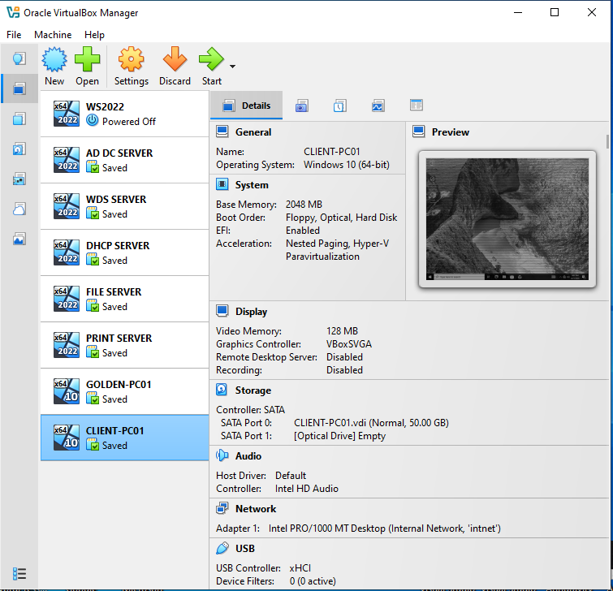

# IT Support Homelab

A practical Windows infrastructure lab that simulates the systems and support workflows found in a small organization. The environment combines Windows Server, Active Directory, DNS, DHCP, Group Policy, file and print services, Windows Deployment Services, PowerShell automation, and incident troubleshooting.

The focus is operational: build the service, test it from a client, break it deliberately, find the root cause, document the fix, and verify the result.



## What This Demonstrates

- Designing a small Windows domain environment.
- Deploying and administering Windows Server roles.
- Managing users, computers, security groups, OUs, and Group Policy.
- Providing DHCP, DNS, SMB file shares, network printing, and PXE deployment.
- Standardizing Windows workstations with golden images and PowerShell.
- Troubleshooting from the client perspective using repeatable checks and evidence.
- Writing SOPs and case studies that another technician can follow.

## Lab Architecture

```text
                         Internal lab network
                              lab.local
                                  |
       +--------------------------+--------------------------+
       |                          |                          |
   +---v---+                  +---v----+                 +---v----+
   | DC01  |                  |DHCP01  |                 | WDS01  |
   | AD DS |                  | DHCP   |                 | PXE    |
   | DNS   |                  |        |                 | Images |
   +---+---+                  +--------+                 +---+----+
       |                                                     |
       +----------------------+------------------------------+
                              |
                  +-----------+-----------+
                  |                       |
              +---v----+              +---v----+
              |FILESRV01|              | PRINT01|
              | SMB     |              | Printing|
              +---+----+              +--------+
                  |
             +----v-----+
             | Clients  |
             | Windows  |
             +----------+
```

> The names and addresses below are the documented lab examples. VirtualBox networking may require a different subnet or addressing plan.

| Host | Role | Example address |
| --- | --- | --- |
| `DC01` | Active Directory Domain Services and DNS | `192.168.1.100` |
| `DHCP01` | DHCP | `192.168.1.101` |
| `WDS01` | Windows Deployment Services and PXE | `192.168.1.102` |
| `FILESRV01` | SMB file shares | `192.168.1.103` |
| `PRINT01` | Print server | `192.168.1.104` |
| `CLIENT01` and other clients | Domain workstations | DHCP |

| Network setting | Example value |
| --- | --- |
| Domain | `lab.local` |
| Network | `192.168.1.0/24` |
| Default gateway | `192.168.1.1` |
| Client DHCP range | `192.168.1.110` - `192.168.1.200` |
| Client DNS | `192.168.1.100` |

## Guided Project Path

Follow the modules in order. Each module includes a README, screenshots, and, where applicable, a standard operating procedure PDF.

| Module | Focus | Evidence |
| --- | --- | --- |
| [01 - AD DS, DNS & GPO](01-AD-DS-DNS-GPO/README.md) | Domain controller, DNS, OUs, users, groups, RDP, and Group Policy | [SOP](01-AD-DS-DNS-GPO/documentation/AD_DS_DNS_GPO_SOP.pdf) |
| [02 - DHCP](02-DHCP/README.md) | DHCP authorization, scopes, leases, reservations, and client options | [SOP](02-DHCP/documentation/DHCP_SOP.pdf) |
| [03 - Golden Image](03-Template-PC-Golden-Image/README.md) | Template workstation preparation, Sysprep, and image standardization | [SOP](03-Template-PC-Golden-Image/documentation/Template_PC_Golden_Image_SOP.pdf) |
| [04 - WDS Imaging](04-WDS-Imaging/README.md) | PXE boot, boot/install images, capture, and deployment | [SOP](04-WDS-Imaging/documentation/WDS_SOP.pdf) |
| [05 - File Server](05-File-Server/README.md) | SMB shares, NTFS permissions, share permissions, and access testing | [SOP](05-File-Server/documentation/File_Server_SOP.pdf) |
| [06 - Automation](06-Automation/README.md) | Unattended setup, workstation configuration, cleanup, and verification | [Scripts](06-Automation/PowerShell%20scripts/) |
| [07 - Print Server](07-Print-Server/README.md) | Shared printers, drivers, deployment, permissions, and queue troubleshooting | README and screenshots |
| [08 - Troubleshooting](08-Troubleshooting/README.md) | Structured incident analysis and infrastructure case studies | [Case studies](08-Troubleshooting/case-studies/) |

## Automation Workflow

```text
WDS deployment
      |
      v
Unattended Windows setup
      |
      v
Configure workstation -> Rename, time, RDP, updates, domain join
      |
      v
Clean up temporary local accounts
      |
      v
Verify workstation -> DNS, domain membership, connectivity, and readiness
```

The PowerShell workflow is split into focused stages:

1. [`01-Configure-Workstation.ps1.ps1`](06-Automation/PowerShell%20scripts/01-Configure-Workstation.ps1.ps1) configures and joins the workstation.
2. [`02-Cleanup-LocalAccounts.ps1`](06-Automation/PowerShell%20scripts/02-Cleanup-LocalAccounts.ps1) removes temporary build accounts and profiles.
3. [`03-Verify-Workstation.ps1`](06-Automation/PowerShell%20scripts/03-Verify-Workstation.ps1) records pass/fail checks for the final state.

## Troubleshooting Method

Every incident follows the same evidence-based loop:

```text
Identify the symptom
        |
Collect configuration and logs
        |
Establish scope
        |
Test one hypothesis
        |
Apply the smallest appropriate fix
        |
Reproduce and verify
        |
Document the resolution
```

Typical checks include `ipconfig /all`, `nslookup`, `ping`, `gpresult /r`, `gpupdate /force`, service status, Event Viewer, and PowerShell-based validation. The [troubleshooting module](08-Troubleshooting/README.md) contains scenario-based guides for AD, DNS, DHCP, WDS, and golden-image issues.

## Technology Stack

| Area | Technologies |
| --- | --- |
| Virtualization | Oracle VirtualBox, isolated internal network |
| Server infrastructure | Windows Server, AD DS, DNS, DHCP, WDS |
| Client management | Windows 10/11, Group Policy, RDP |
| Services | SMB file sharing, Print Services, PXE |
| Automation | PowerShell, unattended XML answer files |
| Documentation | Markdown, screenshots, SOP PDFs, troubleshooting case studies |

## Security and Lab Boundaries

This is a learning environment, not a production deployment. The unattended XML examples contain lab-oriented configuration and should be reviewed before reuse. Do not place real credentials in answer files, use the lab domain on a production network, or expose the isolated environment unnecessarily.

## Status

Active and continuously improving. Current work covers the core Windows infrastructure, workstation deployment, automation, and troubleshooting workflow. Planned additions include WSUS, backup and recovery, VPN, monitoring, centralized logging, security hardening, Microsoft 365 administration, and ITSM/ticketing exercises.

## Author

**Vince Lander Vinas**  
Bachelor of Science in Information Technology

[GitHub: vnc-afk/IT-Support-Homelab](https://github.com/vnc-afk/IT-Support-Homelab)
